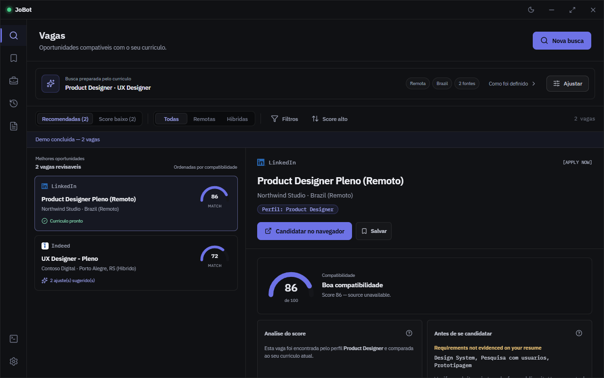
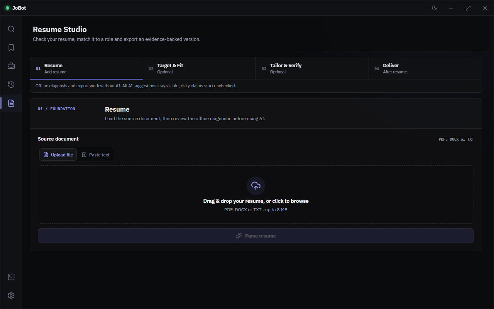
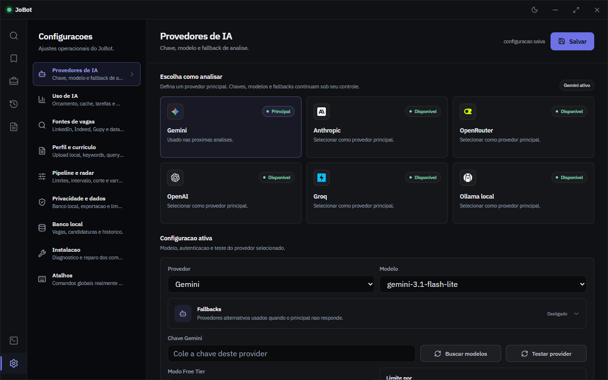
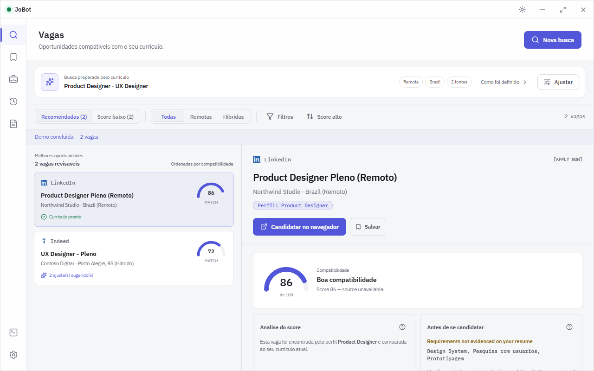

# JoBot

Aplicativo desktop para Windows que busca vagas em vários sites, pontua cada uma
contra o seu currículo e mostra o que falta antes de você se candidatar.



## Download

**[Baixar JoBot v1 para Windows](../../releases/latest)**, arquivo
`JoBot.Setup.1.0.0.exe`, 615 MB.

O instalador é grande porque já vem com tudo embutido: o runtime Python e o
navegador usado para abrir as páginas de vaga. Não precisa instalar mais nada.

> **Aviso do Windows:** o instalador não é assinado digitalmente. O SmartScreen
> vai mostrar "Windows protegeu o computador". Clique em **Mais informações** e
> depois em **Executar assim mesmo**.

Para conferir o arquivo antes de instalar:

```powershell
Get-FileHash "JoBot.Setup.1.0.0.exe" -Algorithm SHA256
```

```text
60E2CB1AD529FBB328C0F683A2EDA687CE12C257E0B0E47499160996A8CF1A84
```

Requisitos: Windows 10 ou 11, 64 bits. Instala por usuário, sem pedir admin.

## O que ele faz

- **Busca em várias fontes:** LinkedIn, Indeed, Gupy, RemoteOK, Remotive,
  WeWorkRemotely, Arbeitnow e Jobicy.
- **Pontua cada vaga** contra o seu currículo e ordena por compatibilidade,
  separando o que vale revisar do que ficou abaixo do corte.
- **Mostra o porquê da nota:** quais requisitos da vaga não têm evidência no seu
  currículo, em vez de só cuspir um número.
- **Resume Studio:** diagnóstico do currículo, ajuste para uma vaga específica e
  export em PDF. O diagnóstico e o export funcionam offline, sem chave de IA.
- **Vagas salvas, candidaturas e histórico** ficam no banco local.

## Privacidade

- Todos os dados ficam no seu computador, em `%APPDATA%\Sencia Job` (SQLite).
- A chave de API que você configurar é cifrada com **DPAPI** do Windows, presa à
  sua conta de usuário.
- **Sem telemetria e sem auto-update.** O app só faz requisições para os sites de
  vagas e, se você configurar uma chave, para o provedor de IA que você escolheu.
- A IA é opcional. Sem chave configurada, a busca, a pontuação offline, o
  diagnóstico do currículo e o export em PDF continuam funcionando.

## Telas

| Resume Studio | Provedores de IA |
| --- | --- |
|  |  |

Tema claro também:



## Arquitetura

```text
Electron + React UI  ->  Go backend  ->  Python/Camoufox worker
                              |
                            SQLite
```

- O renderer React e a casca Electron ficam juntos em `apps/desktop`.
- O backend Go é dono das APIs HTTP, persistência, parsing, score e regras.
- O worker Python é só transporte: abre URLs e devolve HTML para o Go.
- O Electron sobe o backend em `127.0.0.1:48730` com um bearer token por execução.

```text
apps/
  desktop/          React, Vite, TypeScript, Electron, config do electron-builder
  backend-go/       módulo Go, servidor, SQLite, testes
  browser-worker/   worker Python/Camoufox NDJSON
contracts/          contratos JSON entre runtimes
scripts/
  dev/              helpers de desenvolvimento e build do Electron
  release/          preparação dos bundles de runtime
  qa/               smoke, E2E, instalador e automação de QA
resources/icons/    assets de branding usados no empacotamento
```

## Build local

Requer Node 22.12+, Go 1.26+ e Python 3.12 no PATH.

```bash
npm install
npm run build          # renderer
npm test               # 123 testes do renderer
npm run backend:build  # backend Go
```

Gates do backend:

```bash
go -C apps/backend-go build ./...
go -C apps/backend-go vet ./...
go -C apps/backend-go test ./...
```

Para gerar o instalador completo, com Python e Camoufox embutidos:

```bash
npm run release:electron
```

O resultado sai em `release/electron/`.

### Guard de privacidade

`scripts/qa/check-package-personal-data.mjs` roda automaticamente antes de
empacotar e falha o build se algum caminho pessoal vazar para o artefato. Ele
deriva os padrões da conta que está rodando o build, então funciona sem
configuração. Para bloquear strings adicionais, como seu nome ou o arquivo do seu
currículo, crie `scripts/qa/personal-patterns.local.json` (não versionado):

```json
[{ "label": "meu nome", "pattern": "nome[ _-]+sobrenome", "flags": "i" }]
```

## Aviso

Projeto pessoal, sem garantia. As telas usam dados de demonstração e as fixtures
de teste usam personas fictícias.

O app faz scraping de sites de vagas. Respeite os termos de uso de cada site e a
legislação aplicável ao usar.
